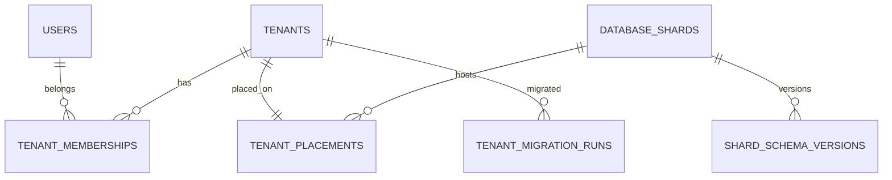
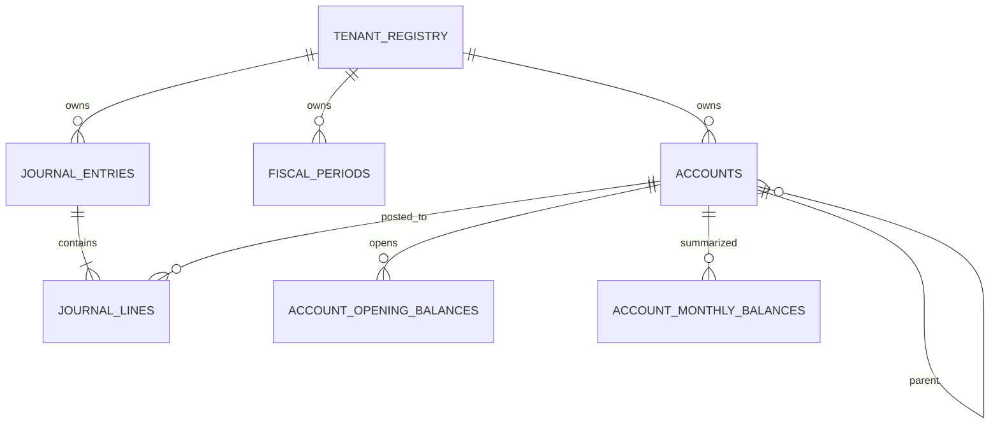
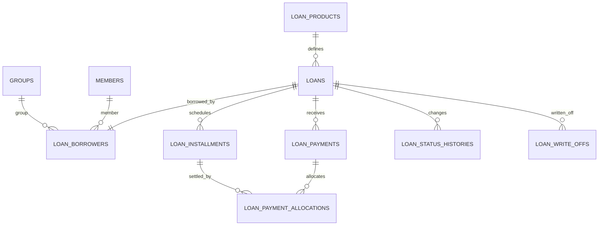

# SIUPK Next — Struktur Database Baru

## 1. Tujuan dokumen

Dokumen ini mendefinisikan rancangan database target untuk SIUPK Next dengan kebutuhan utama:

- hampir 500 tenant;
- skema mudah dirawat;
- migration tidak dijalankan ke ratusan tabel tenant;
- backup existing tetap berjalan per database;
- seluruh ID lama dipertahankan;
- laporan akuntansi tidak berubah;
- tenant dapat dipindahkan antar-shard;
- data tenant tidak dapat saling berelasi secara tidak sengaja.

---

## 2. Topologi database

```text
siupk_platform
├── users
├── tenants
├── tenant_memberships
├── database_shards
├── tenant_placements
├── shard_schema_versions
├── tenant_migration_runs
├── plans
├── subscriptions
└── licenses

siupk_shard_01
├── tenant_registry
├── tenant_sequences
├── organization_profiles
├── organization_units
├── people
├── members
├── groups
├── accounts
├── journal_entries
├── journal_lines
├── loans
├── loan_installments
├── loan_payments
└── ...

siupk_shard_02
└── skema identik

siupk_tenant_dedicated_x
└── skema identik dengan shard bersama
```

`siupk_tenant_dedicated_x` secara teknis tetap dianggap sebagai shard dengan satu tenant. Dengan demikian, kode aplikasi dan migration tidak mempunyai jalur khusus.

---

## 3. Konvensi umum

### 3.1 Tipe data

| Kebutuhan | Tipe |
|---|---|
| Primary key internal | `BIGINT UNSIGNED AUTO_INCREMENT` sebagai `row_id` |
| ID lokal/historis | `BIGINT UNSIGNED` sebagai `id` |
| ID publik | `CHAR(26)` ULID |
| Tenant ID | `BIGINT UNSIGNED` |
| Nilai uang | `DECIMAL(19,2)` |
| Persentase | `DECIMAL(9,4)` |
| Tanggal | `DATE` |
| Waktu | `DATETIME` |
| Boolean | `BOOLEAN` / `TINYINT(1)` |
| Status | `VARCHAR(20–40)` |
| NIK | `CHAR(16)` |
| Nomor telepon | `VARCHAR(20)` |
| Metadata fleksibel | `JSON` secara terbatas |

### 3.2 Kolom standar tenant table

```text
row_id        primary key internal
tenant_id     pemilik record
id            ID lokal tenant, mempertahankan nilai lama
public_id     ULID untuk URL/API bila diperlukan
created_at
updated_at
deleted_at    hanya untuk data yang memang boleh soft-delete
```

### 3.3 Constraint identitas

```sql
PRIMARY KEY (row_id)
UNIQUE (tenant_id, row_id)
UNIQUE (tenant_id, id)
```

`UNIQUE (tenant_id, row_id)` diperlukan agar child table dapat membuat foreign key komposit yang memastikan parent dan child berasal dari tenant sama.

### 3.4 Collation

Gunakan satu standar untuk seluruh database baru:

```text
CHARACTER SET utf8mb4
COLLATE utf8mb4_0900_ai_ci
```

Apabila kompatibilitas dengan server tertentu mengharuskan collation lain, pilih satu collation secara konsisten untuk platform dan seluruh shard.

### 3.5 Timestamp

Gunakan UTC pada database. Konversi ke `Asia/Jakarta` dilakukan di application layer atau report layer.

---

# Bagian A — Platform Database

## 4. `users`

Identitas pengguna global. Satu pengguna dapat menjadi anggota beberapa tenant.

```text
row_id
public_id
name
email
phone
username
password
status
last_login_at
created_at
updated_at
```

Constraint:

```text
UNIQUE (public_id)
UNIQUE (email)
UNIQUE (username)
```

Password harus berupa hash framework dan kolom menggunakan panjang minimal `VARCHAR(255)`.

---

## 5. `tenants`

```text
row_id
public_id
code
name
status
timezone
metadata
provisioned_at
suspended_at
created_at
updated_at
```

Status contoh:

```text
provisioning
active
suspended
migrating
read_only
closed
```

Constraint:

```text
UNIQUE (public_id)
UNIQUE (code)
```

---

## 6. `tenant_memberships`

Menghubungkan user global dengan tenant.

```text
row_id
tenant_id
user_id
status
joined_at
created_at
updated_at
```

Constraint:

```text
UNIQUE (tenant_id, user_id)
FOREIGN KEY tenant_id -> tenants.row_id
FOREIGN KEY user_id -> users.row_id
```

Role detail tetap dapat disimpan di shard karena role biasanya berbeda per tenant.

---

## 7. `database_shards`

```text
row_id
public_id
code
name
driver
host
port
database_name
credential_reference
placement_type
status
maximum_weight
current_weight
created_at
updated_at
```

`credential_reference` bukan password langsung. Nilainya menunjuk ke konfigurasi terenkripsi atau secret provider aplikasi.

`placement_type`:

```text
shared
dedicated
migration
archive
```

---

## 8. `tenant_placements`

```text
row_id
tenant_id
shard_id
status
placed_at
moved_at
created_at
updated_at
```

Constraint:

```text
UNIQUE (tenant_id)
FOREIGN KEY tenant_id -> tenants.row_id
FOREIGN KEY shard_id -> database_shards.row_id
```

Status contoh:

```text
active
read_only
exporting
importing
verifying
switching
failed
```

---

## 9. `shard_schema_versions`

```text
row_id
shard_id
current_version
target_version
status
started_at
completed_at
error_message
created_at
updated_at
```

Digunakan deployment pipeline untuk memastikan seluruh shard berada pada versi migration yang diharapkan.

---

## 10. `tenant_migration_runs`

```text
row_id
public_id
tenant_id
source_database
source_tenant_suffix
target_shard_id
status
started_at
completed_at
source_counts
target_counts
reconciliation_result
error_message
created_at
updated_at
```

Kolom JSON menyimpan ringkasan, bukan menggantikan tabel detail atau log file migrasi.

---

## 11. Platform ER diagram



---

# Bagian B — Tenant Shard Database

## 12. `tenant_registry`

Salinan minimum tenant yang ditempatkan pada shard. Tabel ini memungkinkan seluruh tabel tenant mempunyai foreign key lokal tanpa membuat foreign key lintas database.

```text
id            sama dengan tenants.row_id pada platform DB
public_id
code
name
status
schema_version
synced_at
created_at
updated_at
```

Primary key:

```text
PRIMARY KEY (id)
```

Tidak ada data transaksi di tabel ini.

---

## 13. `tenant_sequences`

```text
tenant_id
sequence_name
next_value
updated_at
```

Primary key:

```text
PRIMARY KEY (tenant_id, sequence_name)
```

Foreign key:

```text
FOREIGN KEY tenant_id -> tenant_registry.id
```

### 13.1 Aturan sequence

- `next_value` adalah nilai yang akan diberikan berikutnya;
- pengambilan ID memakai transaction dan `FOR UPDATE`;
- saat migration selesai, nilainya diatur ke `MAX(id) + 1`;
- sequence tidak boleh dikurangi;
- sequence berbeda dapat digunakan bila dua tabel lama digabung tetapi ruang ID-nya berbeda.

---

# Modul Organization

## 14. `organization_profiles`

Satu profil organisasi per tenant.

```text
row_id
tenant_id
id
legal_name
short_name
registration_number
tax_number
address
phone
email
website
logo_path
timezone
operational_start_date
created_at
updated_at
```

Constraint:

```text
UNIQUE (tenant_id)
UNIQUE (tenant_id, id)
```

---

## 15. `organization_units`

Menggantikan campuran konsep kantor, unit, desa, atau lokasi.

```text
row_id
tenant_id
id
parent_row_id
code
name
type
address
phone
is_active
created_at
updated_at
```

Constraint penting:

```text
UNIQUE (tenant_id, id)
UNIQUE (tenant_id, code)
FOREIGN KEY (tenant_id, parent_row_id)
    -> organization_units (tenant_id, row_id)
```

`type` dapat berisi:

```text
head_office
branch
village
service_unit
```

---

# Modul Identity and Membership

## 16. `people`

Data identitas seseorang, terpisah dari status keanggotaannya.

```text
row_id
tenant_id
id
public_id
national_identity_number
family_card_number
full_name
gender
birth_place
birth_date
phone
photo_path
created_at
updated_at
deleted_at
```

Constraint:

```text
UNIQUE (tenant_id, id)
UNIQUE (tenant_id, national_identity_number)
```

NIK nullable diperbolehkan untuk data lama yang belum lengkap. Validasi duplikat harus dilakukan sebelum membuat unique key pada data produksi hasil migrasi.

---

## 17. `members`

```text
row_id
tenant_id
id
public_id
person_row_id
organization_unit_row_id
member_number
registered_at
status
registered_by_user_id
created_at
updated_at
deleted_at
```

Constraint:

```text
UNIQUE (tenant_id, id)
UNIQUE (tenant_id, member_number)
FOREIGN KEY (tenant_id, person_row_id)
    -> people (tenant_id, row_id)
FOREIGN KEY (tenant_id, organization_unit_row_id)
    -> organization_units (tenant_id, row_id)
```

`id` mempertahankan `anggota_{tenant}.id`.

---

## 18. `member_addresses`

```text
row_id
tenant_id
id
member_row_id
type
address
village_code
postal_code
is_primary
created_at
updated_at
```

---

## 19. `member_businesses`

```text
row_id
tenant_id
id
member_row_id
business_type_row_id
name
description
address
started_at
is_active
created_at
updated_at
```

---

## 20. `member_guarantors`

```text
row_id
tenant_id
id
member_row_id
guarantor_person_row_id
relationship_type
valid_from
valid_until
created_at
updated_at
```

Data `nik_penjamin`, `penjamin`, dan `hubungan` lama dipindahkan ke orang penjamin dan hubungan ini.

---

# Modul Groups

## 21. `groups`

```text
row_id
tenant_id
id
public_id
organization_unit_row_id
code
name
address
phone
established_at
loan_product_row_id
business_type_row_id
activity_type_row_id
group_level_row_id
group_function_row_id
status
created_at
updated_at
deleted_at
```

`id` mempertahankan `kelompok_{tenant}.id`.

Constraint:

```text
UNIQUE (tenant_id, id)
UNIQUE (tenant_id, code)
```

---

## 22. `group_members`

```text
row_id
tenant_id
id
group_row_id
member_row_id
joined_at
left_at
status
created_at
updated_at
```

Constraint:

```text
UNIQUE (tenant_id, group_row_id, member_row_id, joined_at)
```

---

## 23. `group_officers`

```text
row_id
tenant_id
id
group_row_id
member_row_id
position
started_at
ended_at
created_at
updated_at
```

Ketua, sekretaris, dan bendahara tidak lagi disimpan sebagai kolom nama bebas. Riwayat jabatan dapat dipertahankan.

---

# Modul Accounting

## 24. `accounts`

Menggantikan `akun_level_1`, `akun_level_2`, `akun_level_3`, dan `rekening_{tenant}`.

```text
row_id
tenant_id
id
public_id
parent_row_id
code
name
account_type
normal_balance
level
is_postable
is_active
deactivated_at
legacy_parent_code
created_at
updated_at
```

Constraint:

```text
UNIQUE (tenant_id, id)
UNIQUE (tenant_id, code)
FOREIGN KEY (tenant_id, parent_row_id)
    -> accounts (tenant_id, row_id)
CHECK normal_balance IN ('D', 'C')
```

`legacy_parent_code` dapat disimpan selama fase kompatibilitas, kemudian dihapus setelah seluruh laporan menggunakan relasi baru.

---

## 25. `fiscal_periods`

```text
row_id
tenant_id
id
fiscal_year
fiscal_month
starts_at
ends_at
status
closed_at
closed_by_user_id
created_at
updated_at
```

Constraint:

```text
UNIQUE (tenant_id, fiscal_year, fiscal_month)
CHECK fiscal_month BETWEEN 1 AND 12
```

Status:

```text
open
closing
closed
```

---

## 26. `journal_entries`

Menggantikan header transaksi lama.

```text
row_id
tenant_id
id
public_id
journal_number
transaction_date
sequence_number
source_type
source_row_id
description
legacy_relation
legacy_transaction_type_id
legacy_loan_id
legacy_loan_item_id
status
reversed_entry_row_id
posted_at
posted_by_user_id
created_by_user_id
created_at
updated_at
```

Aturan ID:

- `id` mempertahankan `transaksi_{tenant}.idt`;
- `sequence_number` mempertahankan kolom `urutan`;
- laporan kompatibilitas mengurutkan berdasarkan tanggal, sequence, dan ID;
- `row_id` tidak ditampilkan sebagai ID transaksi.

Constraint:

```text
UNIQUE (tenant_id, id)
UNIQUE (tenant_id, journal_number) jika nomor tidak nullable
FOREIGN KEY (tenant_id, reversed_entry_row_id)
    -> journal_entries (tenant_id, row_id)
```

Status:

```text
draft
posted
reversed
```

---

## 27. `journal_lines`

```text
row_id
tenant_id
id
journal_entry_row_id
line_number
account_row_id
organization_unit_row_id
description
debit
credit
created_at
updated_at
```

Constraint:

```text
UNIQUE (tenant_id, id)
UNIQUE (tenant_id, journal_entry_row_id, line_number)
FOREIGN KEY (tenant_id, journal_entry_row_id)
    -> journal_entries (tenant_id, row_id)
FOREIGN KEY (tenant_id, account_row_id)
    -> accounts (tenant_id, row_id)
CHECK (
    (debit > 0 AND credit = 0)
    OR (credit > 0 AND debit = 0)
)
```

Satu transaksi lama menghasilkan minimal dua line:

```text
rekening_debit  -> debit
rekening_kredit -> credit
```

Nilai raw lama tetap disimpan dalam migration mapping atau staging untuk keperluan audit.

---

## 28. `account_opening_balances`

```text
row_id
tenant_id
id
account_row_id
fiscal_year
debit
credit
source
created_at
updated_at
```

Constraint:

```text
UNIQUE (tenant_id, account_row_id, fiscal_year)
```

Kolom `tb2015`, `tbk2015`, dan seterusnya dipindahkan menjadi baris per tahun.

---

## 29. `account_monthly_balances`

Projection/cache laporan.

```text
row_id
tenant_id
account_row_id
fiscal_year
fiscal_month
opening_debit
opening_credit
movement_debit
movement_credit
closing_debit
closing_credit
recalculated_at
created_at
updated_at
```

Constraint:

```text
UNIQUE (tenant_id, account_row_id, fiscal_year, fiscal_month)
```

Tabel ini tidak boleh menjadi satu-satunya sumber laporan audit. Ia dapat dihapus dan dihitung ulang dari jurnal posted dan saldo awal.

---

## 30. Accounting ER diagram



---

# Modul Lending

## 31. `loan_products`

```text
row_id
tenant_id
id
public_id
code
name
description
interest_method
default_interest_rate
default_term_months
minimum_amount
maximum_amount
borrower_scope
is_active
created_at
updated_at
```

`borrower_scope`:

```text
member
group
both
```

---

## 32. `loans`

Menyatukan struktur umum pinjaman anggota dan kelompok.

```text
row_id
tenant_id
id
legacy_source
public_id
loan_number
loan_product_row_id
sequence_number
proposed_at
verified_at
approved_at
funded_at
disbursed_at
completed_at
principal_amount
interest_rate
term_months
installment_method
status
verification_notes
guidance_notes
verification_time
disbursement_schedule_text
created_by_user_id
created_at
updated_at
```

`legacy_source`:

```text
member_loan
group_loan
```

Constraint:

```text
UNIQUE (tenant_id, legacy_source, id)
UNIQUE (tenant_id, loan_number)
```

Mengapa `legacy_source` masuk unique key: ID dari `pinjaman_anggota_{tenant}` dapat sama dengan ID dari `pinjaman_kelompok_{tenant}`.

---

## 33. `loan_borrowers`

```text
row_id
tenant_id
id
loan_row_id
member_row_id nullable
group_row_id nullable
created_at
updated_at
```

Constraint:

```text
UNIQUE (tenant_id, loan_row_id)
CHECK salah satu dari member_row_id atau group_row_id terisi
```

Foreign key komposit menjaga semua record berasal dari tenant yang sama.

---

## 34. `loan_status_histories`

```text
row_id
tenant_id
id
loan_row_id
from_status
to_status
notes
changed_by_user_id
changed_at
created_at
```

Riwayat status tidak boleh digantikan hanya oleh kolom status terakhir pada `loans`.

---

## 35. `loan_installments`

```text
row_id
tenant_id
id
loan_row_id
installment_number
due_date
principal_due
interest_due
principal_paid
interest_paid
penalty_due
penalty_paid
status
paid_at
created_at
updated_at
```

Constraint:

```text
UNIQUE (tenant_id, id)
UNIQUE (tenant_id, loan_row_id, installment_number)
```

Nilai lama dari `rencana_angsuran_{tenant}` harus dinormalisasi secara eksplisit dari string atau integer menjadi `DECIMAL(19,2)`.

---

## 36. `loan_payments`

```text
row_id
tenant_id
id
public_id
loan_row_id
payment_number
paid_at
amount
payment_method
reference_number
journal_entry_row_id
created_by_user_id
created_at
updated_at
```

Constraint:

```text
UNIQUE (tenant_id, id)
UNIQUE (tenant_id, payment_number)
```

---

## 37. `loan_payment_allocations`

```text
row_id
tenant_id
id
payment_row_id
installment_row_id
component
amount
created_at
updated_at
```

`component`:

```text
principal
interest
penalty
insurance
other
```

Satu pembayaran dapat dialokasikan ke beberapa installment dan komponen.

---

## 38. `loan_write_offs`

```text
row_id
tenant_id
id
loan_row_id
principal_balance
interest_balance
written_off_at
reason
journal_entry_row_id
approved_by_user_id
created_at
updated_at
```

Menggantikan tabel `penghapusan` dan menjaga hubungan dengan jurnal koreksi.

---

## 39. Lending ER diagram



---

# Modul Budgeting

## 40. `budgets`

```text
row_id
tenant_id
id
public_id
fiscal_year
name
status
approved_at
approved_by_user_id
created_at
updated_at
```

---

## 41. `budget_lines`

```text
row_id
tenant_id
id
budget_row_id
account_row_id
organization_unit_row_id
fiscal_month
amount
created_at
updated_at
```

Constraint:

```text
UNIQUE (
    tenant_id,
    budget_row_id,
    account_row_id,
    organization_unit_row_id,
    fiscal_month
)
```

Menggantikan `ebudgeting_{tenant}`.

---

# Modul Assets

## 42. `asset_categories`

```text
row_id
tenant_id
id
code
name
default_useful_life_months
created_at
updated_at
```

---

## 43. `assets`

```text
row_id
tenant_id
id
public_id
organization_unit_row_id
asset_category_row_id
asset_code
name
purchased_at
quantity
unit_cost
useful_life_months
status
validated_at
created_at
updated_at
deleted_at
```

`unit_cost` menggunakan `DECIMAL(19,2)`, bukan teks.

---

## 44. `asset_status_histories`

```text
row_id
tenant_id
id
asset_row_id
from_status
to_status
notes
changed_at
changed_by_user_id
created_at
```

---

# Modul Documents and Settings

## 45. `documents`

```text
row_id
tenant_id
id
public_id
documentable_type
documentable_row_id
document_type
storage_disk
storage_path
original_name
mime_type
size_bytes
checksum
created_by_user_id
created_at
updated_at
```

File tidak disimpan sebagai blob dalam database.

---

## 46. `tenant_settings`

```text
row_id
tenant_id
key
value
value_type
is_encrypted
created_at
updated_at
```

Constraint:

```text
UNIQUE (tenant_id, key)
```

Gunakan hanya untuk konfigurasi yang benar-benar dinamis. Data domain utama tidak boleh dipindahkan ke key-value hanya untuk menghindari migration.

---

# Modul Authorization

## 47. `roles`

```text
row_id
tenant_id
id
code
name
is_system
created_at
updated_at
```

## 48. `permissions`

Permission dapat berada di platform database bila sama untuk semua tenant, atau di shard bila tenant dapat mempunyai permission custom. Rekomendasi awal: katalog permission berada di kode aplikasi, sedangkan role assignment berada di shard.

## 49. `user_roles`

```text
row_id
tenant_id
id
platform_user_id
role_row_id
created_at
updated_at
```

`platform_user_id` adalah referensi logis ke platform database dan tidak mempunyai foreign key lintas database.

---

# Modul Audit and Migration

## 50. `audit_logs`

```text
row_id
tenant_id
id
actor_user_id
action
auditable_type
auditable_row_id
before_values
after_values
ip_address
user_agent
occurred_at
created_at
```

Data sensitif seperti password, secret, dan token harus disensor sebelum masuk audit log.

---

## 51. `legacy_migration_batches`

```text
row_id
tenant_id
public_id
source_database
source_suffix
status
started_at
completed_at
source_checksum
target_checksum
summary
created_at
updated_at
```

---

## 52. `legacy_record_mappings`

```text
row_id
tenant_id
batch_row_id
source_table
source_id
source_secondary_key
target_table
target_row_id
target_local_id
source_snapshot
migrated_at
created_at
```

Constraint:

```text
UNIQUE (
    tenant_id,
    source_table,
    source_id,
    source_secondary_key
)
```

`source_snapshot` menyimpan JSON canonical dari record sumber untuk audit migrasi. Data binary atau file tidak disimpan di kolom ini.

---

## 53. `migration_reconciliation_results`

```text
row_id
tenant_id
batch_row_id
scope
period_start
period_end
source_count
target_count
source_debit
target_debit
source_credit
target_credit
source_balance
target_balance
status
difference_details
created_at
updated_at
```

Scope contoh:

```text
members
groups
loans
journal_month
account_month
loan_balance
```

---

# Bagian C — Indexing Strategy

## 54. Aturan indeks tenant

Untuk query tenant, mayoritas indeks dimulai dengan `tenant_id`.

Contoh:

```text
(tenant_id, status)
(tenant_id, transaction_date)
(tenant_id, account_row_id, transaction_date)
(tenant_id, loan_row_id, due_date)
(tenant_id, member_number)
```

Jangan membuat indeks `tenant_id` tunggal pada semua tabel tanpa melihat query. Pada tabel dengan composite index yang selalu diawali tenant, indeks tunggal sering tidak diperlukan.

---

## 55. Indeks accounting

```text
journal_entries:
- UNIQUE (tenant_id, id)
- (tenant_id, transaction_date, status)
- (tenant_id, source_type, source_row_id)
- (tenant_id, sequence_number, id)

journal_lines:
- (tenant_id, journal_entry_row_id)
- (tenant_id, account_row_id, journal_entry_row_id)

account_monthly_balances:
- UNIQUE (tenant_id, account_row_id, fiscal_year, fiscal_month)
```

---

## 56. Indeks lending

```text
loans:
- UNIQUE (tenant_id, legacy_source, id)
- (tenant_id, status, disbursed_at)
- (tenant_id, loan_product_row_id, status)

loan_installments:
- UNIQUE (tenant_id, loan_row_id, installment_number)
- (tenant_id, due_date, status)

loan_payments:
- (tenant_id, loan_row_id, paid_at)
```

---

# Bagian D — Tenant Isolation

## 57. Foreign key komposit

Contoh parent:

```sql
UNIQUE KEY uq_accounts_tenant_row (tenant_id, row_id)
```

Contoh child:

```sql
FOREIGN KEY (tenant_id, account_row_id)
REFERENCES accounts (tenant_id, row_id)
```

Dengan pola tersebut, record tenant A tidak dapat menunjuk parent tenant B walaupun `row_id` diketahui.

---

## 58. Eloquent model

Eloquent menggunakan `row_id` sebagai primary key internal. Kolom `id` diperlakukan sebagai ID lokal/historis.

```text
$model->getKey()          -> row_id
$model->id                -> ID laporan/historis
$model->tenant_id         -> tenant owner
```

API publik menggunakan `public_id`, bukan `row_id` atau gabungan tenant dan local ID.

---

# Bagian E — Pemetaan Legacy

## 59. Tabel mapping utama

| Legacy | Target |
|---|---|
| `anggota_{tenant}` | `people`, `members`, `member_guarantors` |
| `kelompok_{tenant}` | `groups`, `group_members`, `group_officers` |
| `pinjaman_anggota_{tenant}` | `loans`, `loan_borrowers` |
| `pinjaman_kelompok_{tenant}` | `loans`, `loan_borrowers` |
| `rencana_angsuran_{tenant}` | `loan_installments` |
| `real_angsuran_{tenant}` | `loan_payments`, `loan_payment_allocations` |
| `penghapusan` | `loan_write_offs` |
| `rekening_{tenant}` | `accounts`, `account_opening_balances` |
| `akun_level_1..3` | `accounts` hierarchy |
| `transaksi_{tenant}` | `journal_entries`, `journal_lines` |
| `saldo_{tenant}` | `account_monthly_balances` hasil rekalkulasi |
| `ebudgeting_{tenant}` | `budgets`, `budget_lines` |
| `inventaris_{tenant}` | `assets`, `asset_categories` |
| `users` | platform `users`, `tenant_memberships`, shard `user_roles` |
| `kecamatan` | `organization_profiles`, domain settings |
| `desa` | `organization_units` |
| `licenses` | platform `licenses` |

---

## 60. Pemetaan transaksi legacy

Satu record:

```text
transaksi_{tenant}
- idt
- tgl_transaksi
- rekening_debit
- rekening_kredit
- jumlah
- urutan
- idtp
- id_pinj
- id_pinj_i
- relasi
```

Menjadi:

```text
journal_entries
- id                  = idt lama
- transaction_date    = tgl_transaksi
- sequence_number     = urutan
- legacy_transaction_type_id = idtp
- legacy_loan_id      = id_pinj
- legacy_loan_item_id = id_pinj_i
- legacy_relation     = relasi

journal_lines line 1
- account             = rekening_debit
- debit               = jumlah ternormalisasi
- credit              = 0

journal_lines line 2
- account             = rekening_kredit
- debit               = 0
- credit              = jumlah ternormalisasi
```

Nilai `jumlah` asli disimpan pada source snapshot migration. Jika parser tidak dapat memastikan nilainya, record ditandai invalid dan migration tenant tidak boleh lolos.

---

## 61. Pemetaan saldo historis rekening

Kolom:

```text
saldo_awal
tb2015 / tbk2015
...
tb2022 / tbk2022
```

Menjadi baris `account_opening_balances` per akun dan tahun. Nilai sumber raw disimpan pada migration snapshot.

---

## 62. Pemetaan pinjaman

Karena pinjaman anggota dan kelompok dapat memiliki ID sama, gunakan:

```text
legacy_source = member_loan atau group_loan
id            = ID asli
```

Hubungan internal menggunakan `row_id`, sementara laporan historis tetap menampilkan `id` dan jenis pinjaman.

---

# Bagian F — Rekonsiliasi

## 63. Rekonsiliasi identitas

Untuk setiap source table:

```text
COUNT sumber = COUNT target mapping
COUNT DISTINCT source ID = COUNT DISTINCT target local ID dalam source scope
MIN ID tersedia
MAX ID tersedia
Tidak ada source ID tanpa mapping
Tidak ada mapping ganda
```

---

## 64. Rekonsiliasi accounting

Per tenant, tahun, bulan, dan akun:

```text
SUM debit legacy = SUM debit target
SUM kredit legacy = SUM kredit target
saldo opening legacy = saldo opening target
saldo closing legacy = saldo closing target
jumlah transaksi legacy = jumlah journal_entries target
jumlah transaksi × 2 <= jumlah journal_lines target
```

Jumlah line dapat lebih dari dua bila transformasi baru memecah komponen, tetapi total jurnal harus tetap sama.

---

## 65. Rekonsiliasi pinjaman

Per loan:

```text
principal disbursed
principal paid
interest paid
principal outstanding
interest outstanding
installment count
payment count
status
completion date
```

Semua perbedaan harus menghasilkan exception record yang disetujui, bukan diperbaiki diam-diam.

---

# Bagian G — Backup dan Restore Existing

## 66. Database yang dibackup

Cron existing harus menemukan:

```text
siupk_platform
siupk_shard_01
siupk_shard_02
...
siupk_tenant_dedicated_*
legacy_* selama masa retensi
```

Setiap database tetap menghasilkan satu `.gz`.

---

## 67. Konsekuensi shared shard

Restore seluruh shard tetap sederhana. Restore satu tenant memerlukan temporary restore dan ekstraksi data berdasarkan `tenant_id`.

Karena semua tabel mempunyai `tenant_id`, proses ekstraksi dapat dibuat generik berdasarkan daftar tabel tenant pada schema metadata.

Tidak disarankan menghapus data tenant langsung tanpa arsip dan rekonsiliasi. Pemindahan tenant sebaiknya memakai pola:

```text
export -> import -> verify -> switch placement -> retain source -> cleanup
```

---

# Bagian H — Keputusan desain final

## 68. Ringkasan keputusan

| Area | Keputusan |
|---|---|
| Topologi | Platform DB + beberapa tenant shard |
| Tenant besar | Shard khusus/dedicated memakai skema sama |
| ID lama | Dipertahankan di kolom `id` |
| Internal PK | `row_id` |
| ID baru | Sequence per tenant |
| API ID | ULID `public_id` |
| Isolasi | `tenant_id`, scope, connection, FK komposit |
| Accounting | Journal entry + journal lines |
| Saldo | Projection yang dapat direkalkulasi |
| Uang | `DECIMAL(19,2)` |
| Migration | Per shard, bukan per tabel tenant |
| Backup | Existing cron, satu DB satu `.gz` |
| Cutover | Per tenant dan bertahap |
| Legacy DB | Read-only selama masa audit |

Desain ini sengaja menambahkan `row_id` tanpa mengganti `id` lama. Dengan demikian, Eloquent dan foreign key tetap mudah dikelola, sedangkan laporan dan audit tetap memakai identitas historis yang sama.
