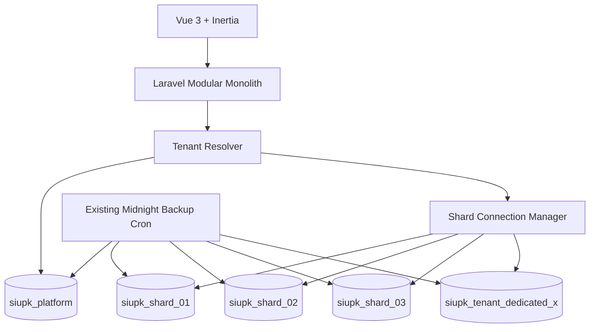
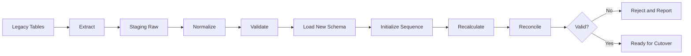

# siupk Next — Project Overview

## 1. Ringkasan

siupk Next adalah proyek penataan ulang arsitektur aplikasi dan basis data siupk agar mampu melayani sekitar 500 tenant dan terus bertumbuh tanpa mengulang pola tabel dinamis seperti `transaksi_1`, `transaksi_4`, `anggota_1`, dan seterusnya.

Desain target menggunakan pola:

- satu **platform database** untuk data SaaS, identitas pengguna, tenant, shard, penempatan tenant, langganan, dan status migration;
- beberapa **tenant shard database** dengan skema yang sama;
- setiap shard menampung sejumlah tenant dan seluruh tabel operasional menggunakan `tenant_id`;
- tenant yang sangat besar atau memiliki kebutuhan isolasi khusus dapat ditempatkan pada shard khusus atau database dedicated tanpa mengubah model domain aplikasi;
- ID lama tetap dipertahankan secara utuh dan tetap digunakan pada laporan;
- `row_id` baru hanya menjadi identitas teknis internal dan tidak menggantikan ID historis;
- transaksi akuntansi diubah menjadi model jurnal berpasangan: `journal_entries` dan `journal_lines`;
- tabel saldo merupakan projection yang dapat dihitung ulang, bukan sumber kebenaran utama.

Sistem backup yang telah ada tetap dipertahankan. Cron tengah malam tetap membackup setiap database server menjadi satu file `.gz` per database. Setelah penerapan shard, target backup utamanya adalah platform database dan seluruh shard database.

---

## 2. Latar belakang

Skema lama mempunyai karakteristik berikut:

- tabel operasional dibuat per tenant menggunakan suffix angka;
- perubahan skema harus diterapkan ke banyak tabel yang mempunyai fungsi sama;
- terdapat schema drift antar-tenant;
- nilai finansial pada beberapa tabel disimpan sebagai teks;
- tidak terdapat foreign key;
- saldo akuntansi dipelihara melalui trigger;
- autentikasi dan konfigurasi tersebar pada beberapa tabel;
- penambahan tenant meningkatkan jumlah tabel secara langsung;
- proses reporting lintas tenant membutuhkan query dinamis atau `UNION` banyak tabel.

Masalah utama bukan sekadar jumlah tabel, tetapi kesulitan memastikan seluruh tenant selalu memakai skema, indeks, constraint, dan aturan bisnis yang sama.

---

## 3. Sasaran proyek

### 3.1 Sasaran utama

1. Menyediakan satu skema tenant baku yang dapat digunakan seluruh client.
2. Mengurangi jumlah unit migration dari ratusan tenant menjadi sejumlah shard.
3. Mempertahankan seluruh ID, nomor transaksi, urutan, kode akun, tanggal, dan nilai historis.
4. Menjamin isolasi data tenant pada aplikasi dan database.
5. Menghilangkan ketergantungan pada nama tabel dinamis.
6. Menjadikan jurnal akuntansi sebagai sumber kebenaran finansial.
7. Memungkinkan tenant dipindahkan dari satu shard ke shard lain.
8. Mendukung tenant dedicated tanpa membuat cabang kode khusus.
9. Mempertahankan sistem backup server yang sudah ada.
10. Menyediakan jalur migrasi bertahap tanpa memindahkan seluruh tenant sekaligus.

### 3.2 Bukan sasaran fase awal

- mengganti mesin database dari MySQL;
- memecah aplikasi langsung menjadi microservices;
- mengganti seluruh UI dalam satu deployment;
- menghapus database lama segera setelah cutover;
- mengubah ID lama agar menjadi global;
- mengubah angka historis hanya agar sesuai dengan tipe data baru;
- membangun ulang sistem backup yang sudah berfungsi.

---

## 4. Prinsip desain

### 4.1 Financial correctness before elegance

Tidak ada perubahan struktur yang boleh mengubah hasil laporan. Setiap migrasi wajib melewati rekonsiliasi nilai dan jumlah record.

### 4.2 Legacy ID is immutable

Setiap record baru mempunyai dua identitas:

- `row_id`: primary key teknis baru, unik dalam database shard;
- `id`: ID lokal tenant yang mempertahankan nilai lama dan terus digunakan pada laporan.

Contoh:

```text
row_id    = 8.249.123   # internal
tenant_id = 4
id        = 7.251       # sama dengan idt lama
```

Constraint minimum:

```text
UNIQUE (tenant_id, id)
```

Untuk tabel yang menggabungkan dua sumber lama dan berpotensi memiliki ID sama, identitas historis menjadi:

```text
UNIQUE (tenant_id, legacy_source, id)
```

### 4.3 Tenant isolation by default

Setiap query tenant wajib mempunyai tenant context. Isolasi diterapkan berlapis melalui:

- tenant resolver;
- dynamic shard connection;
- global scope Eloquent;
- auto-fill `tenant_id`;
- composite foreign key yang menyertakan `tenant_id`;
- test isolasi tenant;
- queue middleware;
- cache key dan storage path yang menyertakan tenant.

### 4.4 Shared schema, flexible placement

Semua shard menggunakan skema yang sama. Penempatan tenant dapat berupa:

- shard bersama untuk tenant standar;
- shard low-density untuk tenant besar;
- database dedicated untuk tenant enterprise.

Aplikasi hanya membaca placement dari platform database dan tidak perlu mengetahui apakah tenant berada di shard bersama atau dedicated.

### 4.5 Journal is the source of truth

Data akuntansi disimpan sebagai jurnal dan baris jurnal. Saldo bulanan hanyalah cache laporan yang dapat direkalkulasi.

### 4.6 Posted financial records are immutable

Jurnal yang sudah diposting tidak boleh diedit atau dihapus. Koreksi dilakukan melalui reversal dan jurnal pengganti.

### 4.7 Migration must be repeatable

Seluruh proses ekstraksi, transformasi, pemuatan, dan validasi harus dapat dijalankan ulang secara idempotent untuk tenant yang sama.

---

## 5. Arsitektur target



### 5.1 Platform database

Platform database menyimpan:

- tenant;
- user global;
- membership user terhadap tenant;
- database shard;
- placement tenant;
- schema version dan migration status;
- paket dan langganan;
- lisensi;
- provisioning status;
- metadata operasional platform.

Platform database tidak menyimpan transaksi akuntansi, anggota, pinjaman, atau data operasional utama tenant.

### 5.2 Tenant shard database

Setiap shard menyimpan:

- registry tenant yang ditempatkan pada shard;
- organisasi dan unit;
- orang dan anggota;
- kelompok;
- pinjaman dan pembayaran;
- chart of accounts;
- jurnal;
- saldo projection;
- budgeting;
- aset;
- dokumen metadata;
- audit log;
- migration mapping dari skema lama.

### 5.3 Ukuran shard

Jumlah tenant per shard tidak ditentukan hanya dari jumlah tenant. Placement menggunakan bobot berdasarkan:

- ukuran database;
- pertumbuhan transaksi;
- jumlah jurnal;
- pengguna aktif;
- request per menit;
- beban report;
- kebutuhan SLA.

Sebagai titik awal, 10–20 shard untuk sekitar 500 tenant dapat digunakan, kemudian disesuaikan dari pengukuran nyata.

---

## 6. Strategi identitas dan sequence

MySQL `AUTO_INCREMENT` tidak dapat menghasilkan sequence terpisah untuk setiap tenant dalam shared table. Karena ID lokal harus tetap mengikuti ruang tenant, digunakan tabel `tenant_sequences`.

```text
tenant_sequences
- tenant_id
- sequence_name
- next_value
```

Contoh sequence:

```text
members
 groups
loans:member
loans:group
journal_entries
journal_lines
loan_installments
loan_payments
```

Pengambilan nomor dilakukan dalam transaction dengan row lock:

```text
SELECT next_value ... FOR UPDATE
UPDATE next_value = next_value + 1
```

Saat migrasi tenant lama selesai, setiap sequence diinisialisasi ke:

```text
MAX(id lama) + 1
```

Dengan demikian:

- ID lama tidak berubah;
- ID baru melanjutkan urutan tenant lama;
- ID yang sama tetap boleh muncul pada tenant berbeda;
- laporan tetap menampilkan ID lokal, bukan `row_id`.

---

## 7. Struktur aplikasi

Aplikasi menggunakan modular monolith agar domain tetap terpisah tanpa overhead microservice.

```text
app/
├── Platform/
│   ├── Tenants
│   ├── Identity
│   ├── Placement
│   ├── Provisioning
│   └── Subscription
├── Tenancy/
│   ├── TenantContext
│   ├── TenantResolver
│   ├── ShardConnectionManager
│   └── Middleware
├── Organization/
├── Membership/
├── Groups/
├── Lending/
├── Accounting/
├── Budgeting/
├── Assets/
├── Documents/
└── Audit/
```

Domain service bertanggung jawab atas transaksi bisnis. Controller tidak diperbolehkan menulis langsung ke banyak tabel tanpa service dan transaction boundary yang jelas.

---

## 8. Aturan akuntansi

1. Nilai finansial menggunakan `DECIMAL(19,2)`.
2. Satu baris jurnal hanya boleh memiliki debit atau kredit, tidak keduanya.
3. Total debit harus sama dengan total kredit sebelum jurnal diposting.
4. Jurnal draft boleh diubah.
5. Jurnal posted tidak boleh diubah atau dihapus.
6. Koreksi menggunakan reversal.
7. Periode tertutup tidak menerima posting baru.
8. Saldo dihitung dari baris jurnal posted.
9. Projection saldo dapat dihapus dan dihitung ulang.
10. ID transaksi dan urutan lama tetap tersedia untuk laporan kompatibilitas.

---

## 9. Integrasi backup yang sudah ada

Sistem backup existing tetap menjadi mekanisme utama disaster recovery:

```text
1 database = 1 file .gz
Cron setiap tengah malam
Menargetkan seluruh database server
```

Setelah desain baru diterapkan, database yang wajib masuk daftar backup:

- `siupk_platform`;
- seluruh `siupk_shard_*`;
- database dedicated tenant;
- database legacy read-only selama masa retensi migrasi.

### 9.1 Restore seluruh shard

Restore file `.gz` langsung ke database shard baru, validasi, kemudian ubah connection endpoint bila diperlukan.

### 9.2 Restore satu tenant dari shared shard

Karena satu file shard berisi beberapa tenant:

1. restore backup shard ke database sementara;
2. hentikan sementara penulisan tenant target;
3. ekspor seluruh record tenant target berdasarkan `tenant_id`;
4. validasi jumlah record dan nilai finansial;
5. impor kembali ke shard aktif atau shard baru;
6. rekalkulasi projection saldo;
7. aktifkan tenant.

Boilerplate tidak membuat sistem backup baru. Ia hanya memastikan semua tabel tenant mudah difilter melalui `tenant_id` dan placement tenant tercatat di platform database.

---

## 10. Workstream proyek

### Workstream A — Foundation

- platform database;
- tenant registry;
- shard registry;
- tenant placement;
- tenant context;
- connection switching;
- queue context;
- tenant sequence;
- audit logging.

### Workstream B — Organization and Membership

- organization profile;
- organization units;
- people;
- members;
- guarantors;
- groups;
- group membership;
- group officers.

### Workstream C — Accounting

- accounts;
- fiscal periods;
- journal entries;
- journal lines;
- posting service;
- reversal;
- monthly balance projection;
- reconciliation reports.

### Workstream D — Lending

- loan products;
- loans;
- borrowers;
- installments;
- payments;
- payment allocations;
- write-offs;
- loan status history.

### Workstream E — Supporting modules

- budgeting;
- assets;
- documents;
- signatures;
- settings;
- reports.

### Workstream F — Legacy migration

- schema inventory;
- source extraction;
- normalization staging;
- record mapping;
- sequence initialization;
- financial reconciliation;
- parallel report comparison;
- tenant-by-tenant cutover.

---

## 11. Tahapan implementasi

### Phase 0 — Freeze dan inventarisasi

- hentikan perubahan manual pada skema lama;
- simpan dump skema seluruh server;
- bandingkan struktur setiap tenant;
- tentukan canonical legacy schema;
- identifikasi tenant dan tabel suffix;
- dokumentasikan seluruh ID dan hubungan implisit.

### Phase 1 — Platform dan tenancy foundation

- buat `siupk_platform`;
- registrasikan tenant;
- registrasikan shard;
- buat placement;
- implementasikan tenant resolver;
- implementasikan dynamic connection;
- implementasikan isolation tests.

### Phase 2 — Skema shard baru

- jalankan migration tenant schema;
- implementasikan sequence lokal tenant;
- implementasikan constraint;
- implementasikan audit log;
- implementasikan domain model baru.

### Phase 3 — Accounting first

- migrasikan akun;
- migrasikan transaksi ke jurnal;
- pertahankan ID dan urutan lama;
- rekalkulasi saldo;
- bandingkan laporan lama dan baru.

Accounting ditempatkan lebih awal karena menjadi area paling sensitif terhadap perubahan angka.

### Phase 4 — Membership dan lending

- migrasikan anggota;
- migrasikan kelompok;
- migrasikan pinjaman;
- migrasikan jadwal dan pembayaran;
- rekonsiliasi saldo pinjaman.

### Phase 5 — Pilot cutover

- tenant internal;
- tenant data kecil;
- tenant menengah;
- tenant kompleks;
- tenant besar.

### Phase 6 — Rollout bertahap

- migrasikan dalam batch kecil;
- pantau laporan dan error;
- simpan legacy database read-only;
- lanjutkan hanya setelah acceptance tenant sebelumnya lolos.

---

## 12. Pipeline migrasi tenant



### 12.1 Rekonsiliasi wajib

Per tenant:

- seluruh legacy ID ditemukan pada target;
- tidak ada ID tambahan yang tidak dapat dijelaskan;
- jumlah transaksi sama;
- total debit sama;
- total kredit sama;
- debit dan kredit target seimbang;
- saldo per akun per bulan sama atau mempunyai exception yang telah disetujui;
- jumlah anggota sama;
- jumlah kelompok sama;
- jumlah pinjaman sama;
- saldo pokok dan jasa sama;
- checksum canonical record sama.

### 12.2 Cutover

1. Tenant masuk maintenance/read-only.
2. Backup terakhir existing dijalankan atau diverifikasi.
3. Delta data sejak migration rehearsal dipindahkan.
4. Rekonsiliasi final dijalankan.
5. Placement tenant diubah ke shard baru.
6. Smoke test dijalankan.
7. Tenant diaktifkan.
8. Legacy tenant dipertahankan read-only.

---

## 13. Risiko utama dan mitigasi

| Risiko | Dampak | Mitigasi |
|---|---|---|
| ID lama berubah | Laporan dan audit tidak konsisten | Simpan `id` lama, gunakan `row_id` terpisah, rekonsiliasi ID |
| Nilai teks dinormalisasi salah | Angka finansial berubah | Raw staging, parser eksplisit, reject nilai ambigu |
| Query lupa tenant scope | Kebocoran data | Middleware, scope, FK komposit, tests |
| Schema drift shard | Deployment tidak konsisten | Migration per shard, schema version registry |
| Shard terlalu padat | Performa turun | Placement berbobot dan tenant relocation |
| Tenant restore dari shared shard | Restore lebih kompleks | Restore ke temporary DB dan ekstrak berdasarkan tenant_id |
| Jurnal berubah setelah posting | Laporan historis berubah | Immutability dan reversal |
| Migration gagal di tengah | Data parsial | Idempotent migration batch dan transaction boundary |
| Queue memakai tenant salah | Data masuk tenant lain | Tenant-aware queue middleware |
| Cache bercampur | Data antar tenant muncul | Namespace cache wajib mengandung tenant_id |

---

## 14. Definition of done

Satu tenant dianggap berhasil dimigrasikan bila:

- placement aktif dan menunjuk shard yang benar;
- seluruh legacy ID tersedia;
- sequence baru berada di atas ID maksimum lama;
- seluruh transaksi akuntansi berhasil dibentuk menjadi jurnal seimbang;
- hasil laporan utama sama dengan sistem lama;
- tidak ada orphan relation;
- isolation test lolos;
- backup shard terdeteksi oleh sistem existing;
- restore rehearsal telah berhasil untuk minimal satu tenant pilot;
- legacy database atau tabel lama berada dalam mode read-only;
- sign-off teknis dan bisnis tersedia.

---

## 15. Deliverable awal

Dokumentasi dan boilerplate dalam paket ini menyediakan:

- arsitektur platform + shard;
- struktur database baru;
- strategi mempertahankan legacy ID;
- migration untuk platform dan shard;
- tenant context;
- connection manager;
- sequence service;
- model base tenant;
- accounting posting service;
- command migration shard;
- queue middleware;
- contoh isolation dan accounting tests;
- panduan pemasangan pada Laravel.

Boilerplate adalah foundation teknis, bukan pengganti analisis bisnis detail untuk setiap laporan lama. Formula laporan dan pemetaan rekening tetap harus divalidasi bersama pengguna bisnis sebelum cutover produksi.
